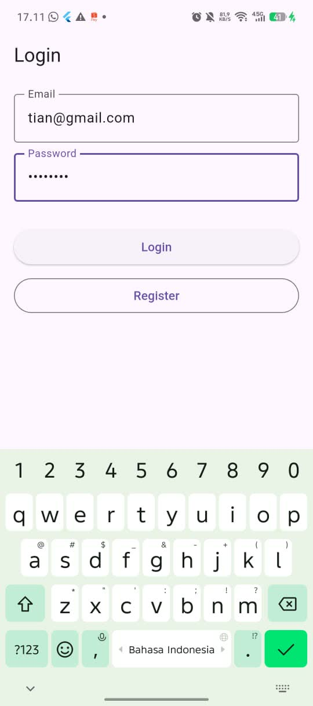
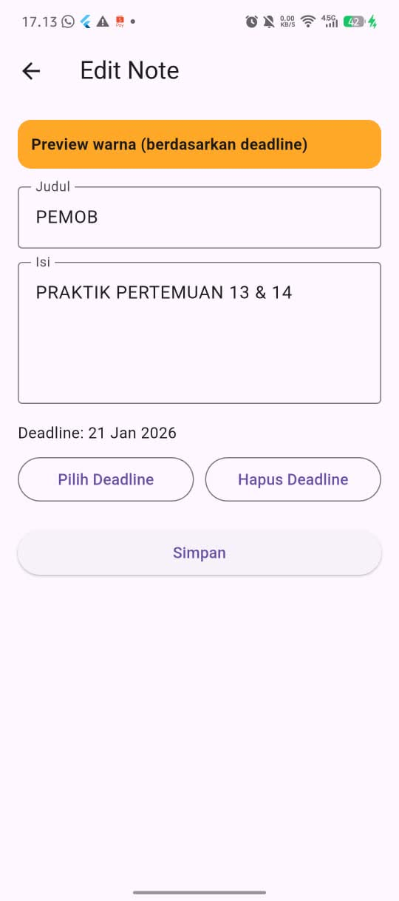
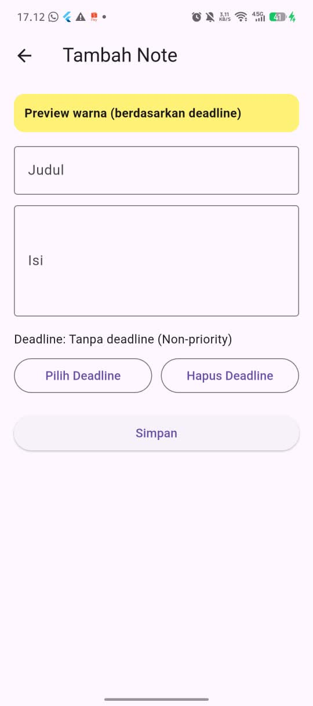
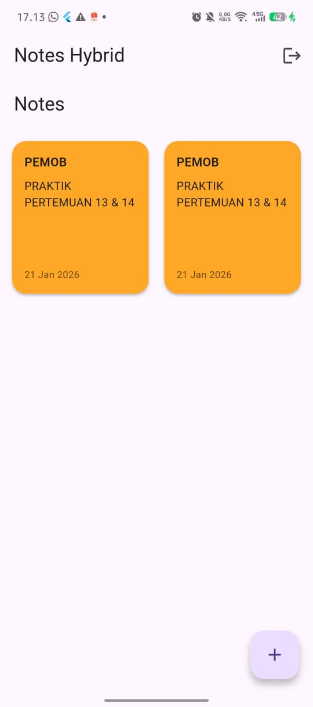
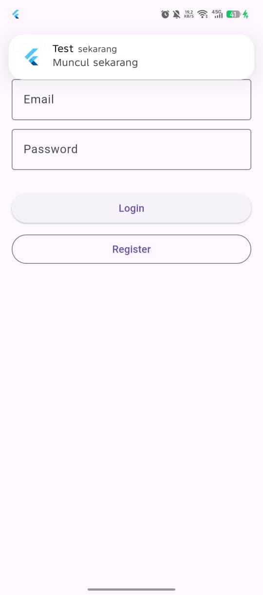
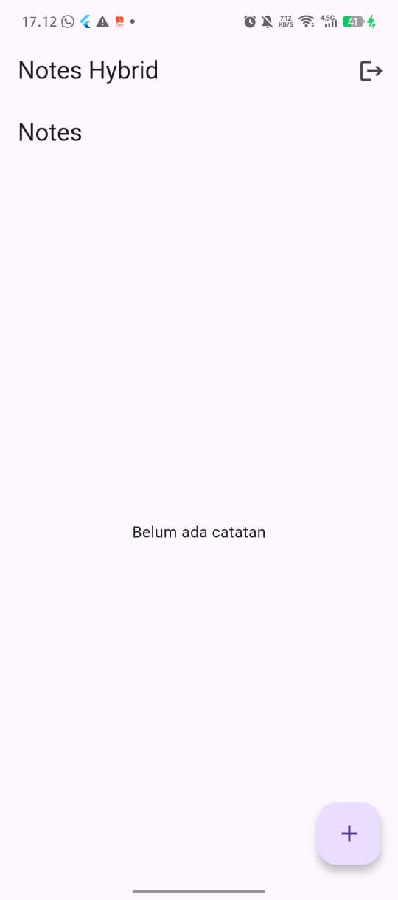
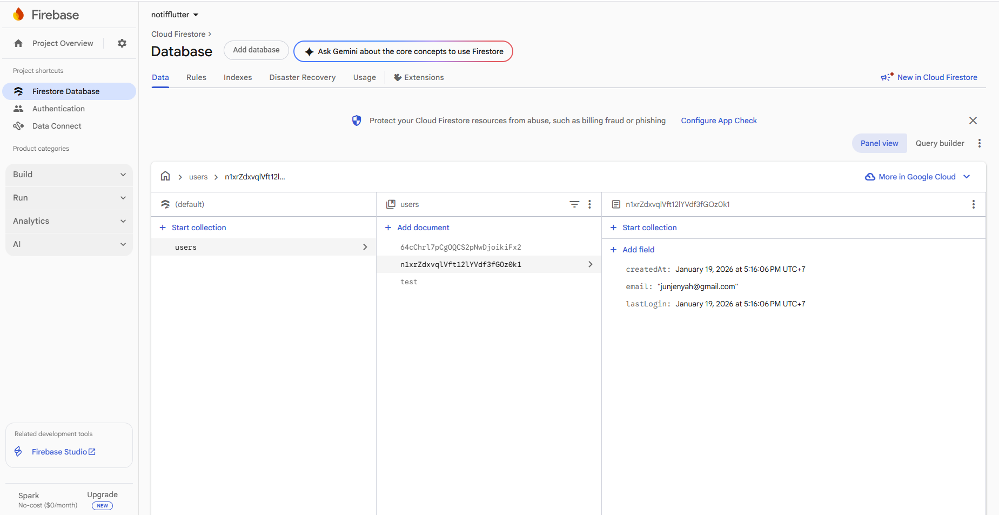
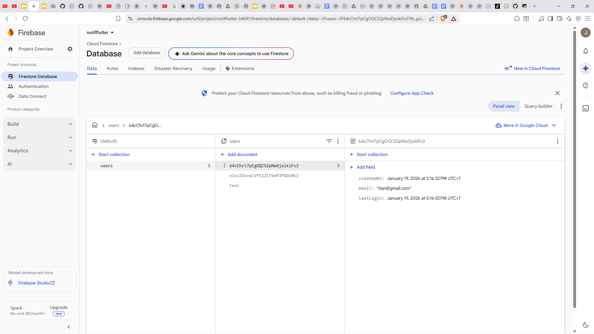

# Pertemuan 13 & 14 – Pemrograman Mobile 2

## 📌 Informasi Tugas

Repository ini digunakan untuk **pengumpulan tugas Pertemuan 13 dan Pertemuan 14**
mata kuliah **Pemrograman Mobile 2**.

**Nama:** Sulastian Setiadi
**Kelas:** RP TIF 23 CID A

---

## 📱 Link APK

APK aplikasi dapat diunduh melalui link berikut:

🔗 **[Download APK](https://drive.google.com/drive/folders/1bEfMXcx_Y7BZextqFR2-1yePdEoOMuVp?usp=sharing)**

---

## 📝 Deskripsi Project

Project ini merupakan aplikasi berbasis **Flutter** yang dibuat sebagai bagian dari
tugas pertemuan 13 dan 14 pada mata kuliah Pemrograman Mobile 2.

Aplikasi dikembangkan menggunakan Flutter dan dapat dijalankan pada platform Android.

---

## 🖼️ Screenshot Aplikasi

Berikut adalah tampilan aplikasi serta databasenya sesuai dengan format **portrait** dan **landscape**
(disusun secara **vertikal**):

### 📱 Mode Portrait

---

###  Database

---

## 🎥 Video Demo Aplikasi

Berikut adalah video demo penggunaan aplikasi:

Klik gambar di bawah untuk melihat video demo aplikasi:

 

---

## 📂 Struktur Project

Project ini mengikuti struktur default Flutter:

* `lib/` → source code utama
* `android/` → konfigurasi Android
* `test/` → unit & widget testing

---

## ✅ Catatan

Repository ini dibuat khusus sebagai **bukti pengumpulan tugas** dan dokumentasi hasil pengerjaan aplikasi Flutter.
